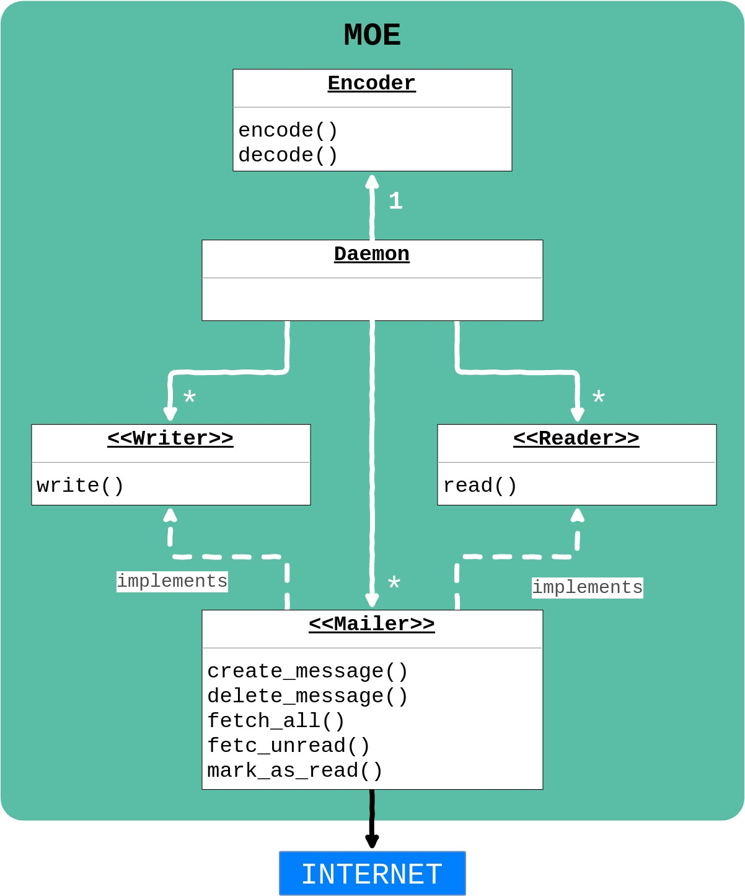

# Architecture



One of `MOE`s goals is to be open for extension by whomever wants to tinker with it.
Hence, there are only 5 software components in `MOE`: a **Reader** to input messages to `MOE`, a **Writer** to output messages locally, a **Mailer** to output messages onlinei, an **Encoder** to translate to and from any cypher code, and a **Daemon** to control them all.

## Software

### Reader Interface
Any class implementing a `read()` method can be used as a **Reader**. It's any means by which a string can be inputed to `MOE`: e.g. camera, button, CLI, email, text message.
An example of an already implemented **Writer** is: **Gmailer**.

### Writer Interface
Any class implementing a `write()` method can be used as a **Writer**. It's any means by which a string can be outputed from `MOE`: e.g. sound, printer, email, text message.
Examples of already implemented **Writer**s are: **Echoer** and **Gmailer**.

### Mailer Interface
A **Mailer** is any class that mplements **Reader** and **Writer**, as well as the following methods:
```python
create_message()      delete_message()
fetch_all()           fetch_unread()
mark_as_read()
```

It is any means by which a string can be outputed through the internet from `MOE`: e.g. API's.
An example of an already implemented **Mailer** is: **Gmailer**.

The data unit for a Mailer, refered to as `MOE`'s email dict in the documentation, is the following:
```python
{id: int, content: str, labels: [str], unread: bool}
```

### Encoder Class
The **Encoder** class receives a CSV with the dictionnary of the cypher code you want to use (e.g. [MORSE.csv](https://gitlab.com/cegal/MOE/blob/master/MORSE.csv). Its `encode()` and `decode()` methods are called by **Daemon**.

### Daemon
The entrypoint for `MOE`. It is the single point of control for all of the components.

### Dependencies
For the full list of dependencies, please check [requirements.txt](https://gitlab.com/cegal/MOE/blob/master/requirements.txt)
* Python3 (preferably 3.6+ to support f-strings)
* [Gmail Python API](https://developers.google.com/gmail/api/quickstart/python)

## Hardware
The following components are just a reference. You may choose the brand/model of your choice.

* Raspberry Pi (any model)
* Breadboard
* Jumper Cables
* Buttons
* LEDs
* [Buzzer](https://www.adafruit.com/product/1536)
* Optional
  * Wifi Dongle or Ethernet cable
  * [Camera](https://www.raspberrypi.org/products/camera-module-v2/)
  * [Thermal Printer](https://www.adafruit.com/product/597)

