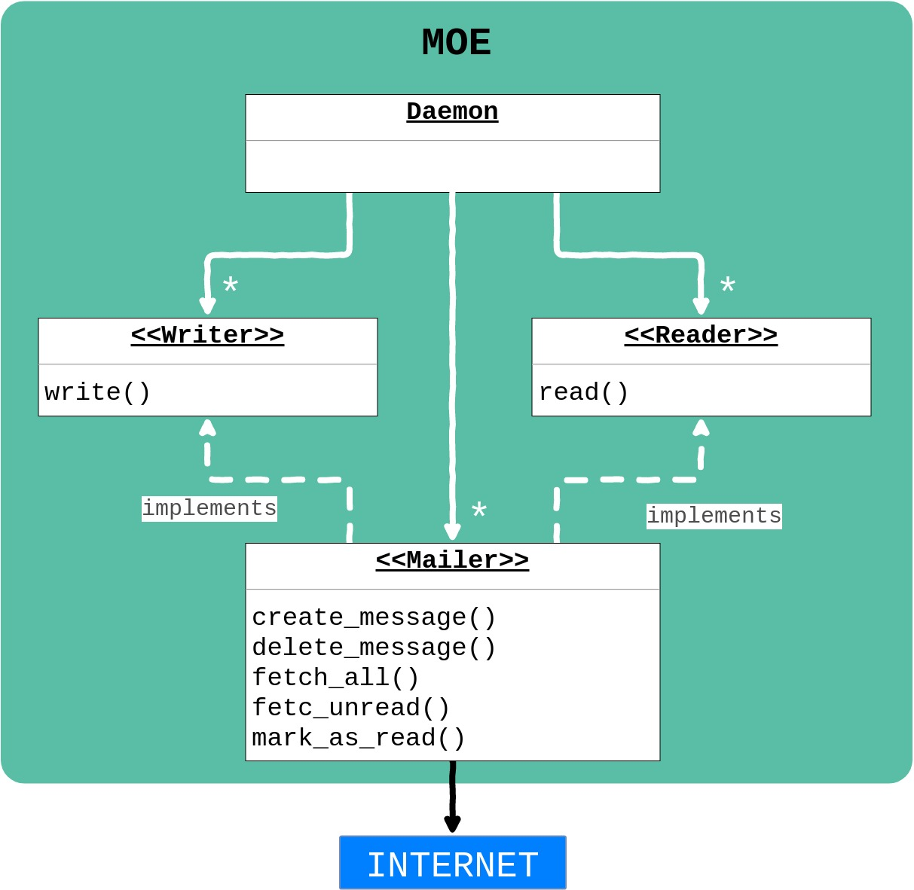

# Architecture

```important:: ADD THIS SOMEWHERE
   .. code-block:: python
     # TODO check if id is int of str
     {id: int, content: str, labels: [str], unread: bool}
```

In an attempt to keep naming conventions homogenous, you may find that some of `MOE`'s modules are oddly named.



One of `MOE`s goals is to be open for extension by whomever wants to tinker with it.
Hence, the only required method for a new input type is `Reader`'s `read()` and the only method for a new output type is `Writer`'s `write()`.
The `Daemon` will send to the appropriate `Writer` the morse code captured by a `Reader` as a string containing the characters: `.` and `_`.


In order to keep power and resource consumption at bay, a **pub/sub** approach will be taken when retrieving new messages from Gmail. For users who don't want to deal with a webserver awaiting the push notification, we will also support timed queries to the Gmail API.


# Components

### Physical
The following components are just a reference. You may choose the brand/model of your choice.

* Raspberry Pi (any model)
* Breadboard
* Jumper Cables
* Buttons
* LEDs
* [Buzzer](https://www.adafruit.com/product/1536)
* Optional
  * Wifi Dongle or Ethernet cable
  * [Camera](https://www.raspberrypi.org/products/camera-module-v2/)
  * [Thermal Printer](https://www.adafruit.com/product/597)

### Software
For the full list of dependencies, please check [requirements.txt](https://gitlab.com/cegal/MOE/blob/master/requirements.txt)
* Python3
* [Gmail Python API](https://developers.google.com/gmail/api/quickstart/python)
